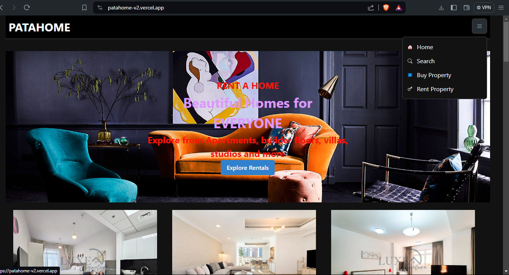

PATAHOME: Own/Rent your dream home today.

Introduction
[Try PATAHOME](https://bit.ly/patahome)
[Project Blog](https://www.linkedin.com/posts/kibetse_patahome-redefining-real-estate-exploration-activity-7206624491026673664-wu0t?utm_source=share&utm_medium=member_desktop)
[LinkedIn](https://www.linkedin.com/in/kibetse/)
PATAHOME is a real estate platform that enables users to easily search and discover properties for sale or rent. Developed using Next.js, a popular React framework, PATAHOME provides a seamless and responsive user experience across desktop and mobile devices.

The platform is hosted on Vercel, a leading cloud platform for static sites and serverless functions. You can access the live site at patahome.vercel.app. Additionally, you can read more about the project in the final project blog article.

The project was developed by Nehemiah Kibet, a full-stack web developer with a passion for creating innovative real estate technology solutions.

Features
Intuitive Search: PATAHOME offers a user-friendly search interface, allowing users to filter properties by location, price range, number of bedrooms, and other key criteria.
Responsive Design: The platform is optimized for seamless navigation and viewing on both desktop and mobile devices, ensuring a consistent and enjoyable experience.
Property Details: Each property listing provides comprehensive information, including images, descriptions, amenities, and contact details for the listing agent or owner.
Saved Searches: Users can save their preferred search criteria and receive notifications when new properties matching their preferences become available.
User Accounts: PATAHOME allows users to create accounts, save favorite properties, and manage their search history and saved searches.
Installation
To run PATAHOME locally, follow these steps:

Clone the repository:
Copy
git clone https://github.com/NesBet/patahome.git
Navigate to the project directory:
Copy
cd patahome
Install the dependencies:
Copy
npm install
Start the development server:
Copy
npm run dev
Open your web browser and visit http://localhost:3000 to access the PATAHOME application.
Usage
Using PATAHOME is straightforward:

Search for Properties: On the home page, users can enter their desired location, price range, and other filters to search for available properties.
Explore Listings: The search results page displays a list of properties that match the user's criteria. Each listing provides key details, such as property type, number of bedrooms and bathrooms, and the listing price.
View Property Details: By clicking on a specific listing, users can access a detailed page with more information about the property, including photos, a description, and contact details for the listing agent or owner.
Save Searches and Favorites: Registered users can save their preferred search criteria and mark properties as favorites for easy access later.

Back Story
As an aspiring real estate enthusiast, I have always been fascinated by the process of finding the perfect property. Growing up, I had the privilege of witnessing my parents' journey in acquiring their dream home. The countless hours spent scouring through listings, attending open houses, and negotiating with agents left a lasting impression. I saw firsthand the challenges they faced in finding a property that truly aligned with their needs and preferences.

Determined to improve this process, I embarked on a mission to develop a more intuitive and user-friendly real estate platform. Drawing inspiration from my own experiences and the pain points shared by friends and family, I set out to create PATAHOME.

Contributing
We welcome contributions to the PATAHOME project! If you would like to get involved, please follow these steps:

Fork the repository.
Create a new branch for your feature or bug fix.
Make your changes and ensure the code passes all tests.
Submit a pull request, detailing the changes you've made and the problem they solve.
I will review your contribution and provide feedback or merge it into the main codebase.
